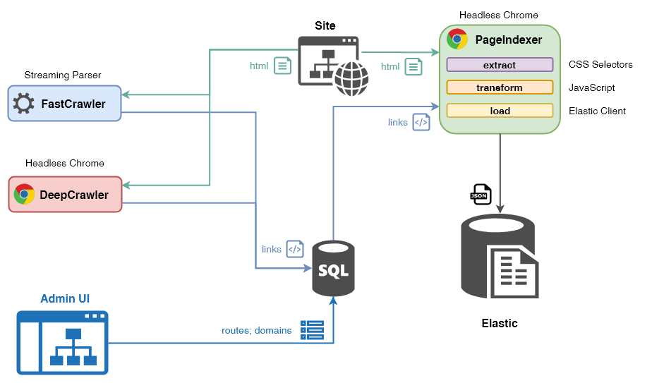
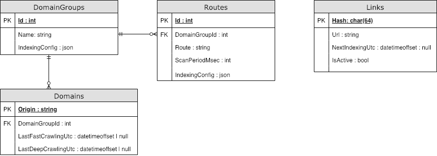

# Краулер

<!-- TOC depthFrom:2 -->

- [Архитектура](#архитектура)
  - [Алгоритм работы](#алгоритм-работы)
- [Docker](#docker)
  - [Системные требования](#системные-требования)
- [Настройка индексации](#настройка-индексации)
  - [1. Зарегистрировать группу доменов](#1-зарегистрировать-группу-доменов)
  - [2. Добавить необходимые роуты](#2-добавить-необходимые-роуты)
  - [3. Настроить ETL-процесс](#3-настроить-etl-процесс)
    - [ExtractSchema](#extractschema)
      - [Работа с массивами](#работа-с-массивами)
      - [Данные из URL и явные значения](#данные-из-url-и-явные-значения)
    - [TransformScript (опционально)](#transformscript-опционально)
  - [Проверка индексации](#проверка-индексации)
- [Настройка запуска](#настройка-запуска)
    - [MS SQL](#ms-sql)
    - [Elastic](#elastic)
    - [FastCrawler](#fastcrawler)
    - [DeepCrawler](#deepcrawler)
    - [PageIndexer](#pageindexer)
    - [TestIndexer](#testindexer)
- [Разработка](#разработка)
  - [NPM scripts](#npm-scripts)

<!-- /TOC -->

## Архитектура

Краулер построен на основе [puppeteer](https://github.com/GoogleChrome/puppeteer) — NodeJS интерфейса для Headless Chrome.



Он состоит из четырех независимых логических процессов:

- FastCrawler — сбор ссылок с помощью потокового парсера
- DeepCrawler — сбор ссылок с помощью Headless Chrome
- PageIndexer — индексация содержимого страниц с помощью Headless Chrome
- TestIndexer — ExpressJS endpoint для проверки индексации конкретной страницы

Настройки и очередь индексации страниц хранятся в MS SQL БД `qa_search`



### Алгоритм работы

1. **FastCrawler** / **DeepCrawler** на каждой итерации:

- Выбирает один домен из таблицы `Domain`
- Обходит все ссылки, доступные на страницах этого домена
- Фильтрует ссылки по зарегистрированным роутам
- Добавляет их в таблицу `Links`, указав время следующей индексации как `Date.now()`

2. **PageIndexer** на каждой итерации:

- Выбирает все ссылки `Links`, для которых настало время индексации
- Поочередно загружает страницы в Headless Chrome
- Индексирует видимое содержимое страниц, согласно настройкам роута
- Сохраняет результат в указанные индексы ElasticSearch
- Удаляет из ElasticSearch страницы, которые не удалось загрузить
- Вычисляет время следующей индексации страницы согласно настройкам роута

Для изоляции ресурсоемких процессов Headless Chrome, весь сервис оформлен в виде Docker-контейнера.

## Docker

Для запуска краулера в Docker-контейнере необходимо:

1. Выполнить сборку образа:

```sh
docker build -t qa-search-crawler .
```

2. Запустить контейнер. Для корректной работы необходимо задать настройки с помощью переменных окружения(параметр `-e`) и, при необходимости, связать с другими контейнерами(параметр `--link`). Например:

```sh
docker run -p 4957:4957 --link qa-search-mssql:qa-search-mssql --link qa-search-elastic:qa-search-elastic -e DB_HOST=qa-search-mssql -e ELASTIC_HOST=qa-search-elastic:9200  --name=qa-search-crawler qa-search-crawler
```

### Системные требования

|         | Min        | Max                 |
| ------: | :--------- | :------------------ |
|     CPU | 2 core     | 1 + N cores         |
|     RAM | 600 MB     | 350 MB + N x 250 MB |
| Network | 100 Mbit/s |
|     HDD | не важно   |

где N — кол-во процессов Chromium

## Настройка индексации

Для добавления сайта в очередь индексации необходимо:

### 1. Зарегистрировать группу доменов

Создаем запись в таблице `DomainGroups`.

| Id  | Name     | IndexingConfig |
| :-- | :------- | :------------- |
| 1   | Сайт	 | null           |

Добавляем к ней несколько доменов в таблице `Domains`. Домены **не должны** заканчиваться на `/`.

| Origin                | DomainGroupId | LastFastCrawlingUtc | LastDeepCrawlingUtc |
| :-------------------- | :------------ | :------------------ | :------------------ |
| https://moskva.domain.ru | 1             | NULL                | NULL                |
| https://spb.domain.ru    | 1             | NULL                | NULL                |

### 2. Добавить необходимые роуты

Создаем необходимые роуты [в стиле ExpressJS](https://github.com/pillarjs/path-to-regexp) в таблице `Routes`.

| Id  | DomainGroupId | Route                      | ScanPeriodMsec | IndexingConfig |
| :-- | :------------ | :------------------------- | :------------- | :------------- |
| 1   | 1             | /personal/podderzhka/(.\*) | 7200000        | null           |

Поле `ScanPeriodMsec` отвечает за период индексации группы страниц, которые соответствуют заданному роуту.

### 3. Настроить ETL-процесс

Заполняем JSON-поле `IndexingConfig`:

- либо в таблице `DomainGroups` (применяется по-умолчанию ко всем роутам),
- либо в таблице `Routes` (переопределяет настройки по-умолчанию).

Оно состоит из трех полей

- `extractSchema: Object` — JSO-объект c CSS-селекторами,
  отвечающими за извлечение данных со страницы
- `transformScript?: string` — Тело JavaScript функции, которая преобразует JSON документ
  с этапа "extract" в формат индекса ElasticSearch.
- `indexName: string` — Имя индекса ElasticSearch, куда сохраняются данные.

#### ExtractSchema

JSON DSL для извлечения данных со страницы. В базовом варианте представляет собой:

```json
{
  "{JSON property name}": "{CSS selector} | {HTML attribute name}"
  // ...
}
```

Пример:

```json
{
  "title": "title | textContent",
  "keywords": "meta[name=keywords] | content",
  "description": "meta[name=description] | content",
  "body": "body | innerText"
}
```

##### Работа с массивами

Также возможно извлечение текста из нескольких HTML-элементов в массив JSON-объектов. Пример:

```json
{
  "actions": [
    ".internet-tariff .action-container",
    {
      "title": "h4 | innerText",
      "link": "a.action-link | href"
    }
  ]
}
```

В результате будет получен объект вида:

```json
{
  "actions": [
    { "title": "Foo", "link": "http://test.com/foo" },
    { "title": "Bar", "link": "http://test.com/bar" }
  ]
}
```

##### Данные из URL и явные значения

Также в DLS доступны переменные из роута, Query String и URL страницы через префикс **`:`**.
И жестко заданные значения — через префикс **`=`**. Пример:

URL: `https://spb.domain.ru/personal/podderzhka/devices?propName=propValue`  
Route: `/:area/podderzhka/:section`

```json
{
  "pageUrl": ":url",
  "siteArea": ":area",
  "siteSection": ":section",
  "queryProp": ":propName",
  "exactProp": "=exactValue"
}
```

В результате будет получен объект вида:

```json
{
  "pageUrl": "https://spb.domain.ru/personal/podderzhka/devices?propName=propValue",
  "siteArea": "personal",
  "siteSection": "devices",
  "queryProp": "propValue",
  "exactProp": "exactValue"
}
```

Более подробно см. в `evaluatePage.ts` и `evaluatePage.test.js`;

#### TransformScript (опционально)

Функция трансформации принимает два параметра:

- `json: object` — JSON-документ, полученный из этапа "extract",
- `conext: object` — Объект, содержащий
  - поле `url: string` — URL страницы
  - поля-переменные из роута
  - поля-параметры из Query String

Эта функция должна либо вернуть результирующий JSON-объект:

```js
const { date } = context;
return {
  ...json,
  date: new Date(date)
};
```

Либо изменить существующий:

```js
json.url = context.url;
json.tariffId = parseInt(json.tariffId);
```

### Проверка индексации

Для проверки индексации конкретной страницы по конкретному роуту нужно выполнить следующий запрос:

```http
POST https://localhost:4957/check-route HTTP/1.1
Content-Type: application/json

{
  "url": "https://spb.domain.ru/personal/podderzhka/devices",
  "route": "/personal/podderzhka/(.*)",
  "extractSchema": {
    "title": "title | textContent",
    "keywords": "meta[name=keywords] | content",
    "description": "meta[name=description] | content",
    "body": "body | innerText"
  }
}
```

В результате будет получен JSON-документ, аналогичный тому, который сохраняется в ElasticSearch.

## Настройка запуска

Настройка процессов краулера осуществляется с помощью переменных окружения:

- `CRAWLER_MODE`: - запуск только одного из процессов краулера.  
  Значения: `fast-crawler | deep-crawler | page-indexer`.  
  FastCrawler и DeepCrawler должны быть в единственном экземпляре,  
  а PageIndexer может иметь несколько параллельных инстансов.

#### MS SQL

- `DB_HOST` - адрес хоста БД, например `localhost`
- `DB_USER` - имя пользователя
- `DB_PASSWORD` - пароль

#### Elastic

- `ELASTIC_HOST` - адрес хоста(с указанием порта), например `http://localhost:9200`

#### FastCrawler

- `FAST_CRAWLER_CONCURRENCY_LEVEL` - количество параллельно обрабатываемых url
- `FAST_CRAWLER_QUEUE_CHECK_INTERVAL` - интервал проверки очереди, мс
- `FAST_CRAWLER_HOST_CRAWLING_INTERVAL` - интервал запуска для каждого хоста, мс

#### DeepCrawler

- `DEEP_CRAWLER_CONCURRENCY_LEVEL` - количество параллельно обрабатываемых url
- `DEEP_CRAWLER_QUEUE_CHECK_INTERVAL` - интервал проверки очереди, мс
- `DEEP_CRAWLER_HOST_CRAWLING_INTERVAL` - интервал запуска для каждого хоста, мс

#### PageIndexer

- `INDEXER_CONCURRENCY_LEVEL` - количество параллельно индексируемых ссылок
- `INDEXER_LINKS_BATCH_SIZE` - размер партии ссылок для индексации, извлекаемых из БД за один раз
- `INDEXER_QUEUE_CHECK_INTERVAL` - интервал проверки очереди, мс

#### TestIndexer

- `INDEXER_TEST_PORT` - порт для отправки тестовых запросов

## Разработка

### NPM scripts

Для разработки и тестирования в NPM зарегистрированы следующие скрипты.

Каталог **`debug`**:

- `npm run debug:fast-crawler` — собрать все ссылки с указанного домена в файл с помощью FastCrawler,
- `npm run debug:deep-crawler` — собрать все ссылки с указанного домена в файл с помощью DeepCrawler.

Каталог **`scripts/database`**:

- `npm run scripts:reset-database` — удалить все данные краулера из БД `qa_search`
  и зарегистрировать тестовые домены и роуты.
